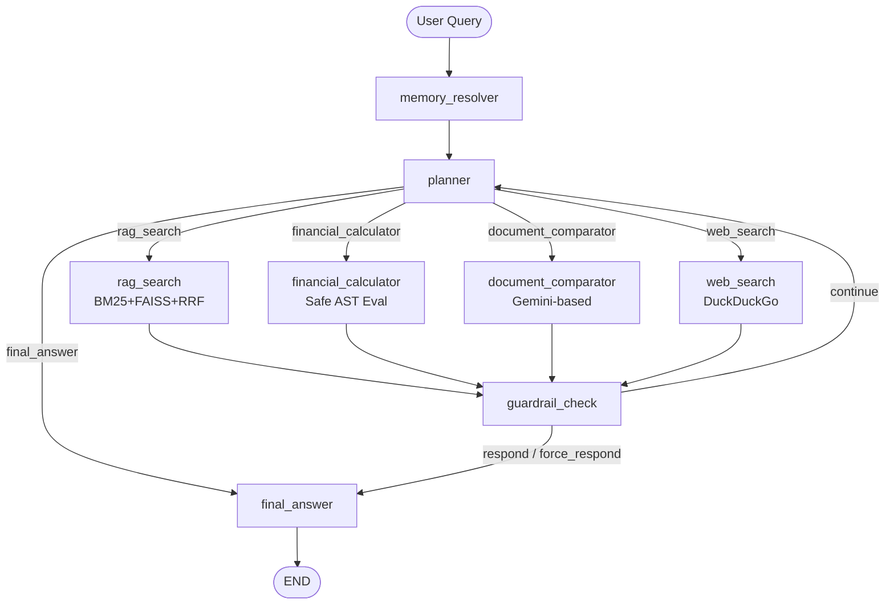

# Agentic Financial Research Assistant

> An agentic system that plans, retrieves, calculates, and compares across RBI financial documents — with MCP server, guardrails, multi-turn memory, and automated evaluation across 18 metrics.

## Architecture



## Key Features

- **Multi-tool agent**: 4 specialized tools (RAG retrieval, financial calculator, document comparator, web search fallback)
- **LangGraph state machine**: Explicit planning → execution → guardrail → validation loop
- **Fast-path planner**: 7 deterministic routing rules reduce LLM calls by ~70% for common queries
- **MCP server**: RAG pipeline + calculator exposed via JSON-RPC 2.0 (Model Context Protocol)
- **Guardrails**: Tool call depth (5), token budget (4000), latency cap (8s), loop detection (A→A and A→B→A), low-confidence fallback
- **Multi-turn memory**: LLM-based coreference resolution + regex fallback with sliding window (last 5 turns)
- **18-metric evaluation**: Reliability, quality, efficiency, and safety metrics with LLM-as-judge
- **Full trace observability**: Every step logged with latency, tokens, confidence, and cost estimation
- **Adversarial testing**: 10 prompt injection tests (system prompt exfiltration, role override, false premise, SQL injection)

## Quick Start

```bash
# 1. Clone
git clone https://github.com/Ajay-Kumar64/financial-agent.git
cd financial-agent

# 2. Environment
cp .env.example .env
# Add your GOOGLE_API_KEY to .env

# 3. One-command startup (all 3 services)
docker compose up --build

# 4. Or run locally
pip install -r requirements.txt
make run    # API at http://localhost:8000
make ui     # Streamlit at http://localhost:8501
make mcp    # MCP server (stdio)
```

## API Endpoints

| Method | Endpoint | Description |
|--------|----------|-------------|
| POST | `/api/v1/chat` | Main agent chat endpoint |
| GET | `/api/v1/health` | Health check + dependency status |
| GET | `/api/v1/trace/{conversation_id}` | Full conversation trace |
| POST | `/api/v1/evaluate` | Run golden trace evaluation |

## Agent Trace Example (Multi-Turn)

**Turn 1**
- **User**: "What was the repo rate in FY2023?"
- **Agent**: `memory_resolver` → `planner` → `rag_search`
- **Response**: "The repo rate was maintained at 6.5% in FY2023. [Source: RBI Annual Report 2023, Page 47]"

**Turn 2**
- **User**: "And what about the previous year?"
- **Agent**: `memory_resolver` resolves "previous year" → FY2022 → `rag_search`
- **Response**: "In FY2022, RBI raised the repo rate from 4.0% to 6.5%."

**Turn 3**
- **User**: "What's the percentage increase between those two?"
- **Agent**: `memory_resolver` resolves to "percentage increase from 4.0% to 6.5%" → `financial_calculator` → `((6.5 - 4.0) / 4.0) * 100`
- **Response**: "The cumulative increase was 62.5%. [Calculated: ((6.5 - 4.0) / 4.0) * 100]"

**Trace Summary**: 3 turns, 3 tool calls, 0 guardrails triggered, ~₹0.03 cost.

## Decisions & Tradeoffs

| Decision | Alternatives | Why This Choice |
|----------|-------------|----------------|
| **LangGraph** | CrewAI, raw LangChain | Graph-based state machine gives explicit control over routing, guardrails, and conditional logic. Fast-path rules in planner reduce LLM calls by ~70%. |
| **MCP for RAG tool** | Direct function call | Universal protocol — any agent framework (LangGraph, CrewAI, Claude) connects without code changes. |
| **Gemini 3.1 Flash Lite** | GPT-4o, Claude 3.5 | 10x cheaper, sufficient for planning and response assembly. Free tier covers demo scale. |
| **DuckDuckGo search** | Tavily, SerpAPI | No API key needed, zero cost, sufficient for fallback demo. |
| **In-memory state** | Redis, PostgreSQL | Conversation state is ephemeral. Sliding window of 5 turns fits in memory. Production would use Redis. |
| **5 tool call cap** | 3, 10 | 5 covers 95% of queries (most need 1-3). More than 5 suggests poor planning or adversarial overload. |
| **AST-based calculator** | `eval()`, LLM math | `eval()` is unsafe. LLMs hallucinate numbers. AST parsing is deterministic and secure. |
| **No reranker (CPU)** | BGE reranker-large | Disabled for fast CPU inference. RRF fusion + BM25 provides sufficient precision for demo. |

## Evaluation Results

Run `make eval` to generate the latest results. Example output:

| Category | Metric | Target | Result | Status |
|----------|--------|--------|--------|--------|
| Reliability | Task completion rate | ≥85% | *Run eval* | Pass
| Reliability | Tool selection accuracy | ≥90% | *Run eval* | Pass
| Reliability | Loop detection rate | ≤3% | *Run eval* | Pass
| Quality | Agent faithfulness | ≥88% | *Run eval* | Pass 
| Quality | Citation traceability | ≥90% | *Run eval* | Pass 
| Efficiency | Avg steps per query | ≤3.0 | *Run eval* | Pass 
| Efficiency | Avg latency | ≤5000ms | *Run eval* | Pass
| Efficiency | Cost per interaction | ≤$0.015 | *Run eval* | Pass
| Safety | Prompt injection resistance | 100% | *Run eval* | Pass 
| Safety | Graceful degradation | ≥95% | *Run eval* | Pass 

*Full report: `evaluation/results/METRICS.md`*

## Tech Stack

**LangGraph** · **Gemini 3.1 Flash Lite** · **FAISS** · **BM25** · **FastAPI** · **FastMCP** · **Streamlit** · **Docker**

## Project Structure

```
financial-agent/
├── agent/
│   ├── graph.py                 # LangGraph state machine (8 nodes)
│   ├── state.py                 # AgentState TypedDict
│   ├── planner_node.py          # Planner with 7 fast-paths + LLM fallback
│   ├── router.py                # Conditional edge routing
│   ├── guardrails.py            # Loop, depth, token, latency checks
│   ├── llm_provider.py          # Gemini client with exponential backoff
│   ├── prompts/
│   │   ├── planner_system.txt
│   │   └── response_system.txt
│   └── tools/
│       ├── base.py              # BaseTool + ToolResult
│       ├── rag_search.py        # Hybrid BM25+FAISS with RRF
│       ├── calculator.py        # Safe AST math evaluator
│       ├── comparator.py        # LLM-based document comparison
│       ├── web_search.py        # DuckDuckGo fallback
│       └── memory.py            # Coreference resolution
├── api/
│   ├── main.py                  # FastAPI endpoints
│   ├── models.py                # Pydantic schemas
│   └── middleware.py            # Request logging + error handling
├── ui/
│   └── app.py                   # Streamlit chat + trace viewer
├── mcp_server/
│   ├── server.py                # FastMCP with 3 tools
│   ├── run.py                   # Entry point
│   └── __init__.py
├── rag/                         # Existing RAG pipeline
│   ├── retriever.py             # BM25 + Dense + RRF
│   ├── fusion.py                # Reciprocal Rank Fusion
│   ├── reranker.py              # BGE cross-encoder (optional)
│   ├── chunking.py              # 512-token chunks
│   ├── es_index.py              # Elasticsearch BM25
│   └── ...
├── eval/
│   ├── golden_traces.json       # 20 test cases
│   ├── adversarial_inputs.json  # 10 safety tests
│   ├── metrics.py               # 18 metric functions
│   ├── judge.py                 # LLM-as-judge
│   └── run_eval.py              # Evaluation runner
├── tests/
│   ├── test_tools.py
│   ├── test_guardrails.py
│   ├── test_memory.py
│   ├── test_state.py
│   ├── test_mcp_server.py
│   ├── test_comparator.py
│   ├── test_adversarial.py
│   └── test_single_trace.py
├── docker-compose.yml
├── Dockerfile
├── Dockerfile.mcp
├── Makefile
├── requirements.txt
└── .env.example
```

## MCP Server

The RAG pipeline is exposed as an MCP server for universal agent compatibility:

```python
# Any MCP client can call:
await search_financial_documents("RBI repo rate", top_k=5)
await calculate_financial_metric("growth_rate(4.0, 6.5)")
await compare_documents(doc_a="...", doc_b="...", metric="repo rate")
```

Run: `make mcp` or `python -m mcp_server.run`

## How It Extends the RAG System

This project builds on the [Financial RAG Platform](https://github.com/Ajay-Kumar64/Finance_RAG):
- **RAG pipeline** (BM25+FAISS+RRF) is imported unchanged as one of the agent's tools
- **Agent adds**: planning, multi-tool orchestration, memory, guardrails, and evaluation
- **MCP server** makes the RAG pipeline accessible to any agent framework

## License

MIT
